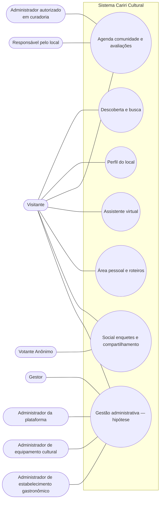
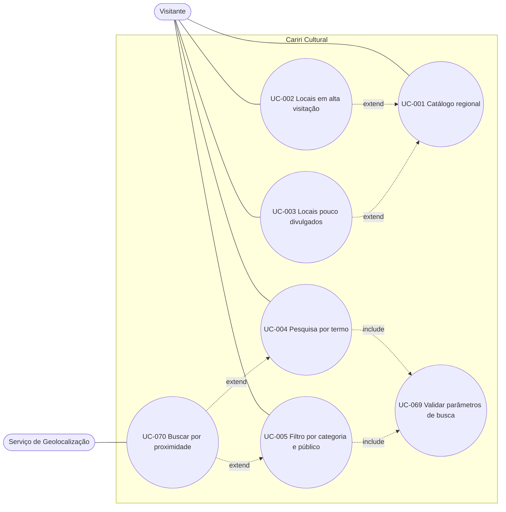
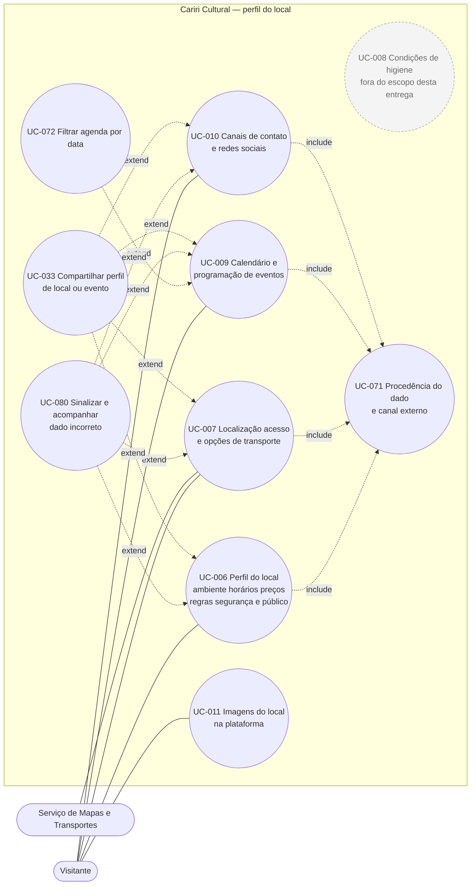
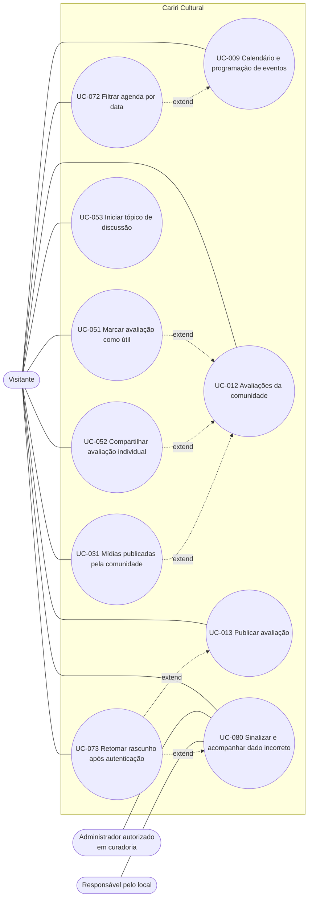
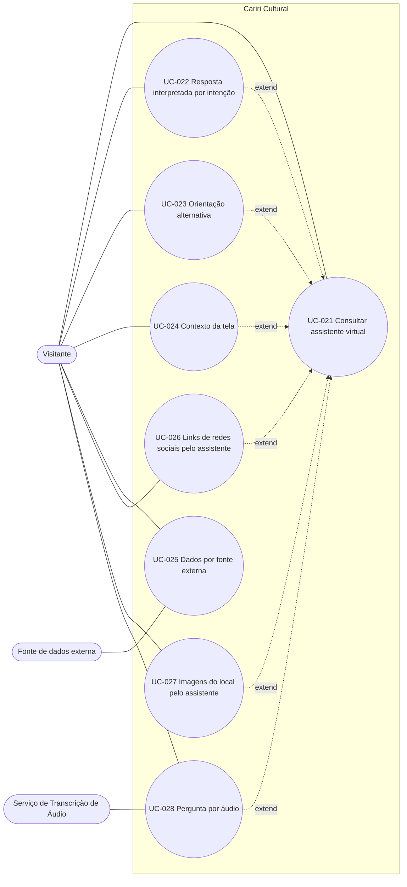
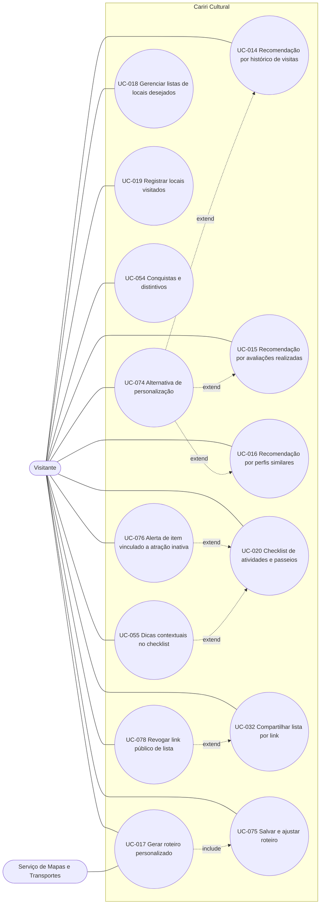
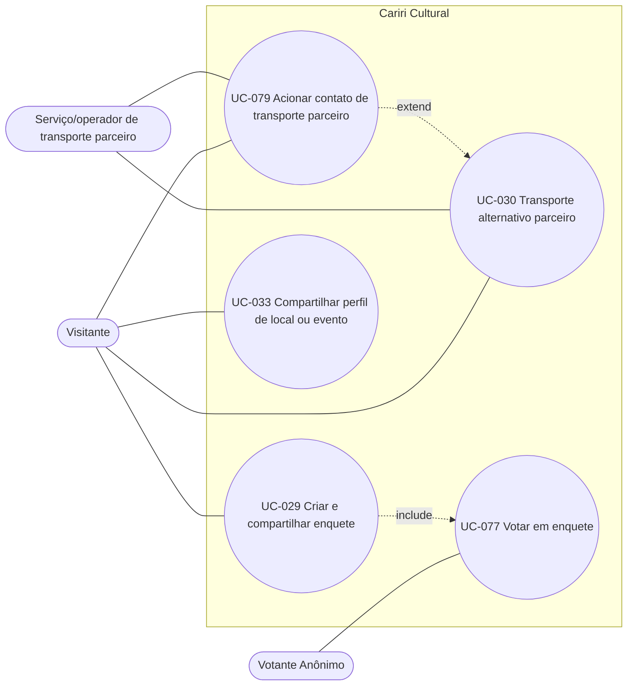
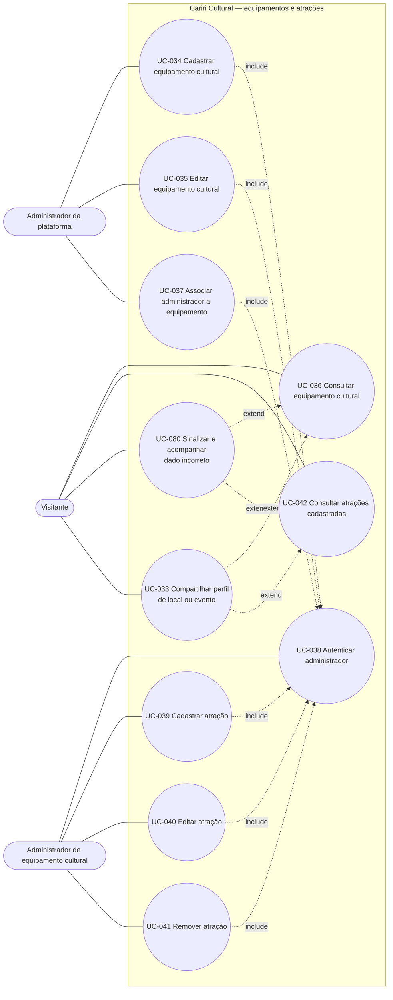
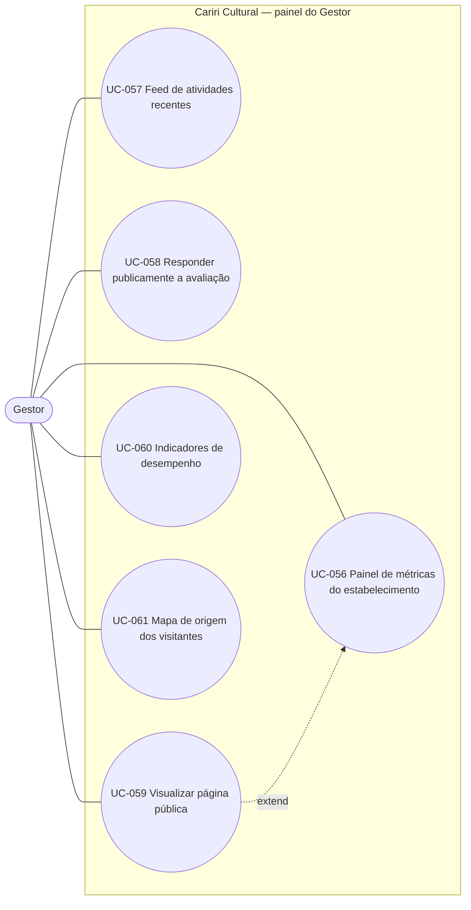
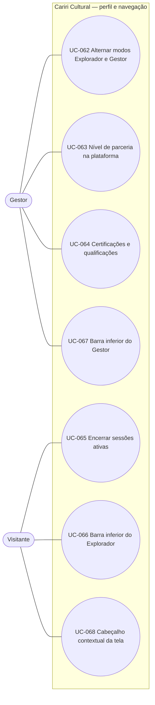

- Os diagramas seguem a notação de **Diagrama de Casos de Uso (UML)** adaptada à sintaxe do Mermaid (que não possui um tipo de diagrama "use case" nativo).
- **Atenção:** A autenticação de usuário comum é **pré-condição** de uso da plataforma, não um caso de uso (por isso não há nó de autenticação genérico nestes diagramas); o único caso de autenticação modelado é UC-038 (administrador), nos diagramas 8 e 9.

---

## 1. Visão geral por épico e ator

---

## 2. Descoberta e busca

---

## 3. Perfil do local

> Os antigos diagramas 3, 4 e 5 foram unificados aqui: a consolidação do Épico 2 reduziu o perfil do local a seis casos, e manter três recortes passou a repetir os mesmos nós.
> UC-008 aparece tracejado por estar fora do escopo desta entrega; não recebe include nem extend enquanto essa decisão valer.
> UC-009 reaparece no diagrama 4, onde seu ciclo de vida é controlado por UC-072. UC-071, UC-080 e UC-033 são nós convidados, detalhados nos diagramas 4 e 7.

---

## 4. Agenda, comunidade e avaliações

---

## 5. Assistente virtual

---

## 6. Área pessoal: recomendações, roteiros, listas e gamificação

---

## 7. Social, enquetes, transporte e compartilhamento

---

## 8. Hipótese administrativa — equipamentos culturais e atrações
> [!WARNING]
> Os diagramas 8 a 11 modelam **hipóteses verificáveis**. O núcleo de cadastro administrativo (UC-034, UC-036, UC-038 a UC-040, UC-042 e UC-043) já integra a entrega atual; os demais casos do Épico 8 (UC-041 e UC-044 a UC-050) e a totalidade dos Épicos 11 a 13 permanecem fora dela. Em todos os casos, os fluxos e telas administrativas ainda dependem de validação com os futuros stakeholders administrativos.

---

## 9. Hipótese administrativa — estabelecimentos, ofertas e publicações

> UC-038 é o mesmo caso do diagrama 8; aparece nos dois recortes porque é incluído por ações de escrita de ambos.

---

## 10. Gestão de estabelecimentos — painel e indicadores

---

## 11. Perfil, sessão e navegação global

---
