- Os diagramas seguem a notação de **Diagrama de Casos de Uso (UML)** adaptada à sintaxe do Mermaid (que não possui um tipo de diagrama "use case" nativo).
- **Atenção:** A autenticação de usuário comum é **pré-condição** de uso da plataforma, não um caso de uso (por isso não há nó de autenticação genérico nestes diagramas); o único caso de autenticação modelado é UC-046 (administrador), nos diagramas 10 e 11.

---

## 1. Visão geral por épico e ator
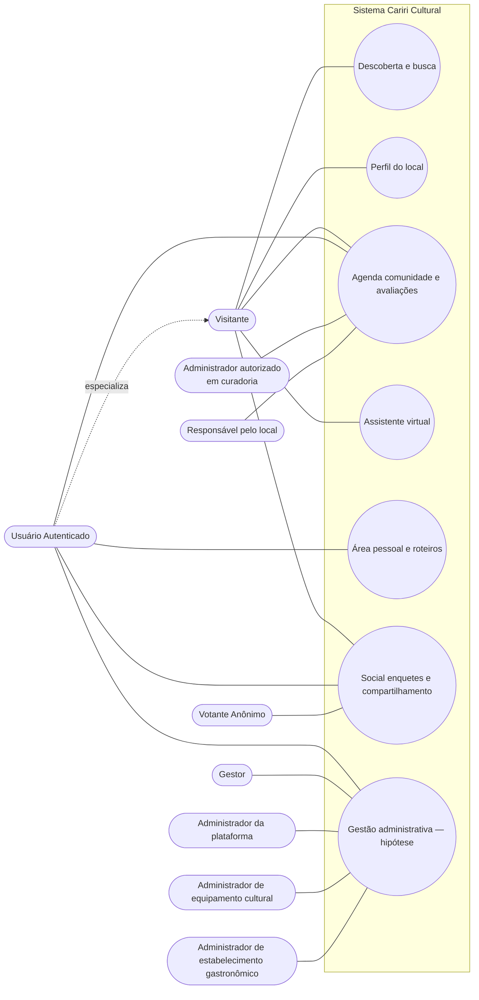

---

## 2. Descoberta e busca
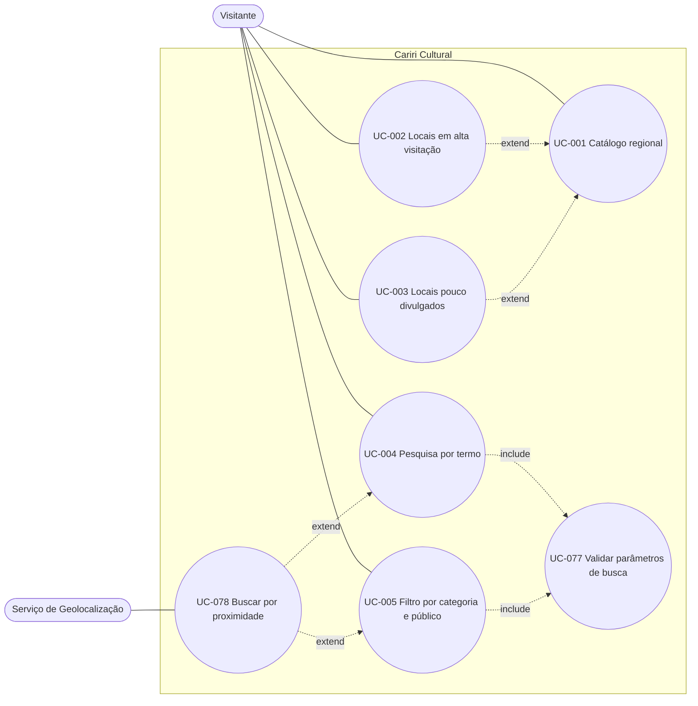

---

## 3. Perfil do local — identidade e contexto
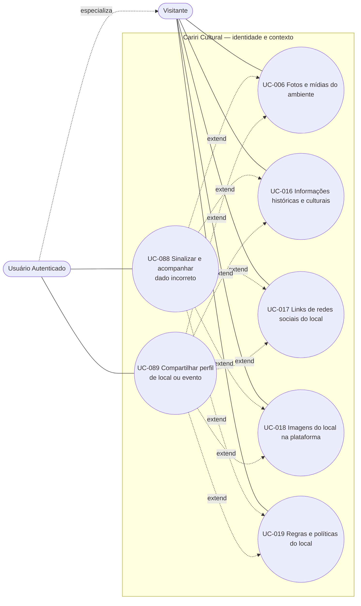

---

## 4. Perfil do local — informações operacionais
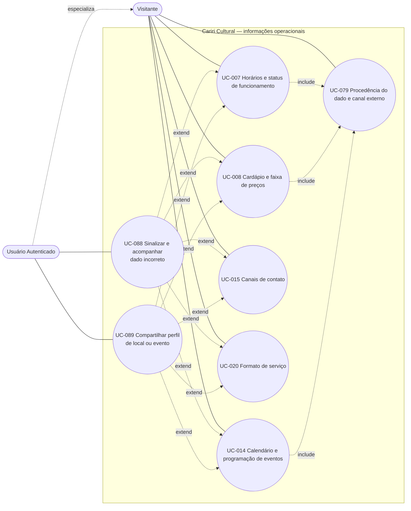

> UC-014 também aparece no diagrama 6, onde é filtrado por data e tem seu ciclo de vida controlado por UC-080. UC-079 reaparece no diagrama 5, pelos mesmos motivos de proveniência.

---

## 5. Perfil do local — condições da visita
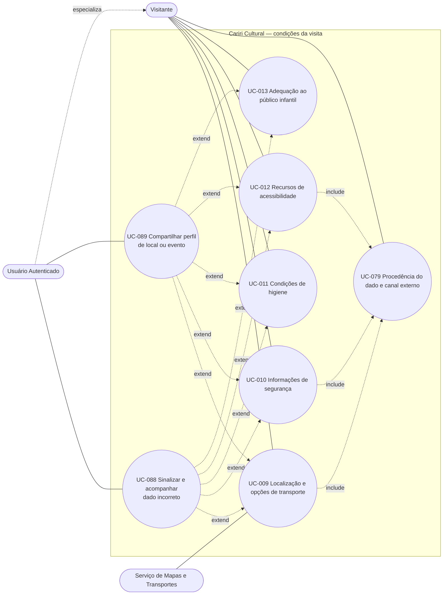

---

## 6. Agenda, comunidade e avaliações
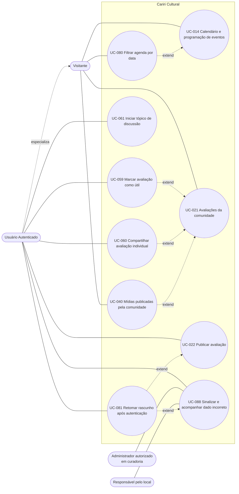

---

## 7. Assistente virtual

---

## 8. Área pessoal: recomendações, roteiros, listas e gamificação
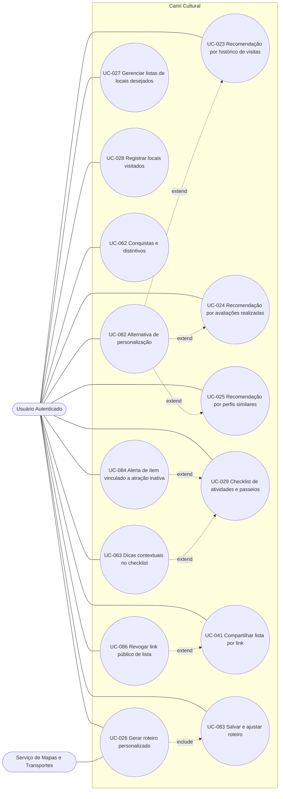

---

## 9. Social, enquetes, transporte e compartilhamento
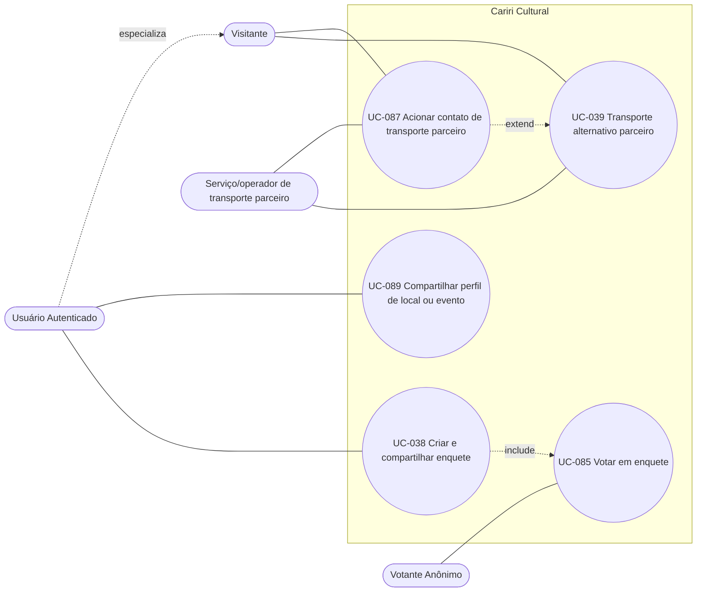

---

## 10. Hipótese administrativa — equipamentos culturais e atrações
> [!WARNING]
> Os diagramas 10 a 13 modelam **hipóteses verificáveis**. O núcleo de cadastro administrativo (RF-042, RF-044, RF-046 a RF-048, RF-050 e RF-051) já integra a entrega atual; os demais casos do Épico 8 (RF-049 e RF-052 a RF-058) e a totalidade dos Épicos 11 a 13 permanecem fora dela. Em todos os casos, os fluxos e telas administrativas ainda dependem de validação com os futuros stakeholders administrativos.

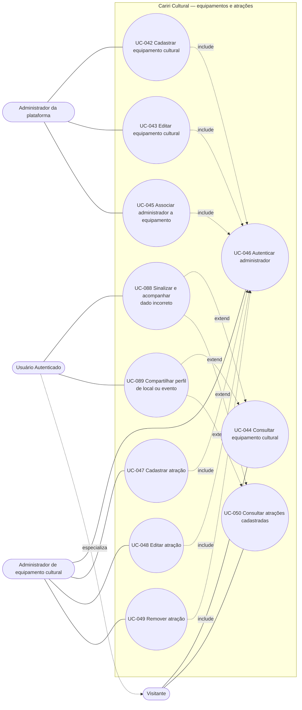

---

## 11. Hipótese administrativa — estabelecimentos, ofertas e publicações
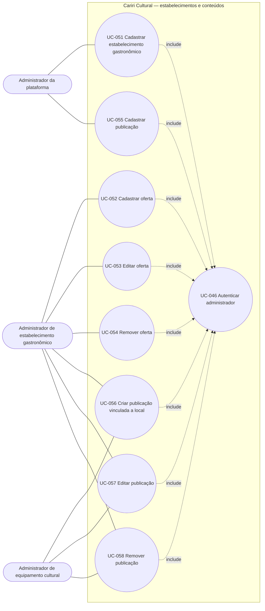

> UC-046 é o mesmo caso do diagrama 10; aparece nos dois recortes porque é incluído por ações de escrita de ambos.

---

## 12. Gestão de estabelecimentos — painel e indicadores
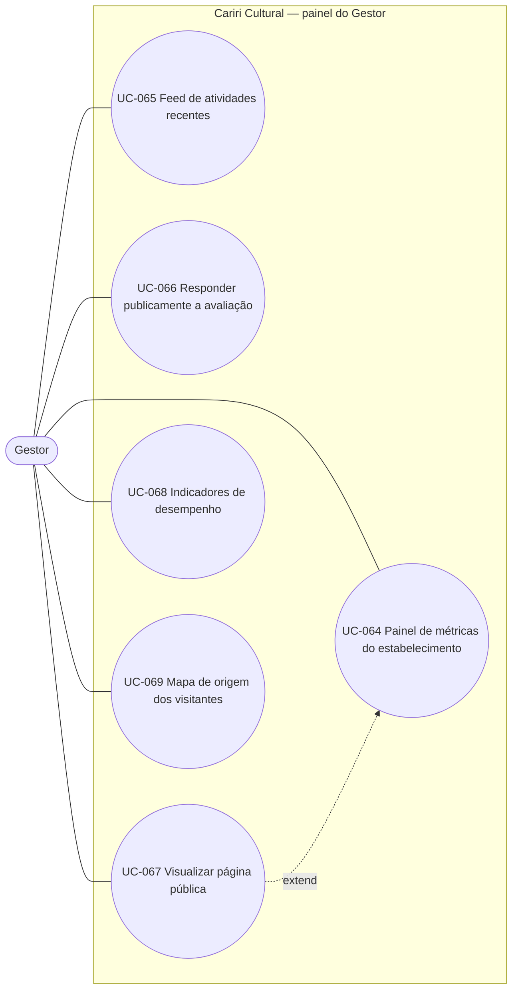

---

## 13. Perfil, sessão e navegação global
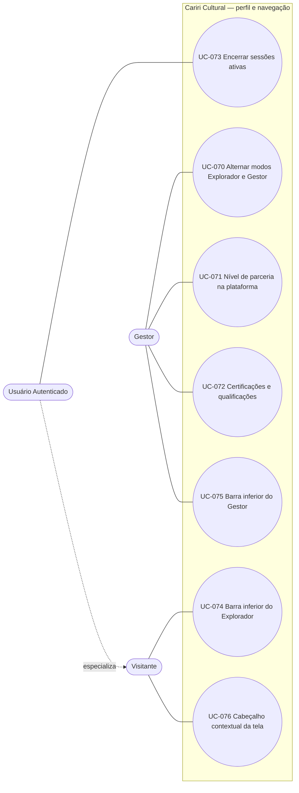

---
