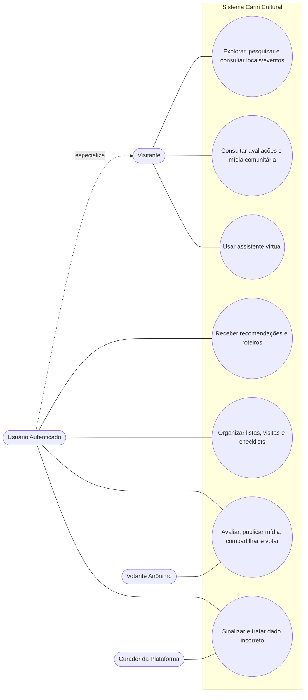
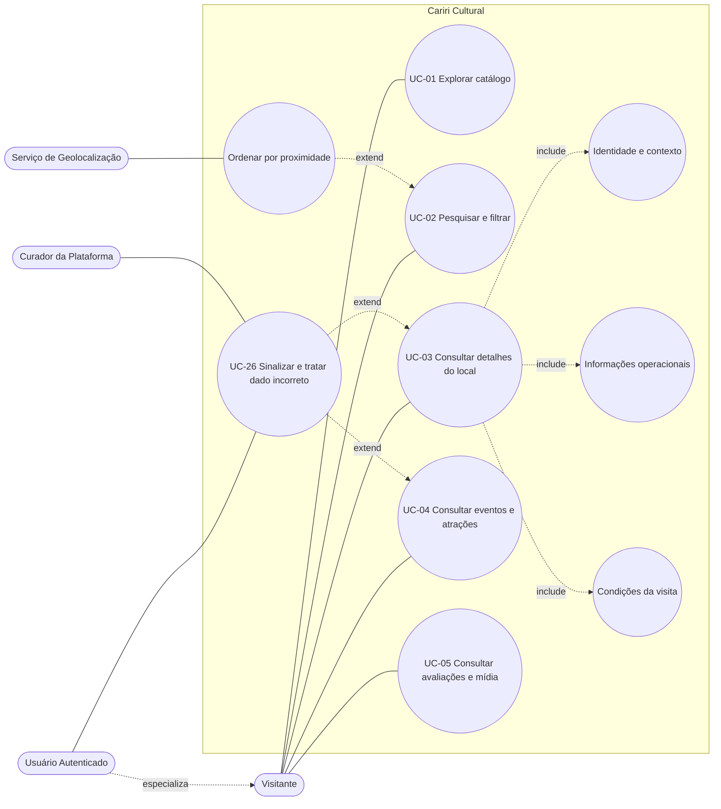
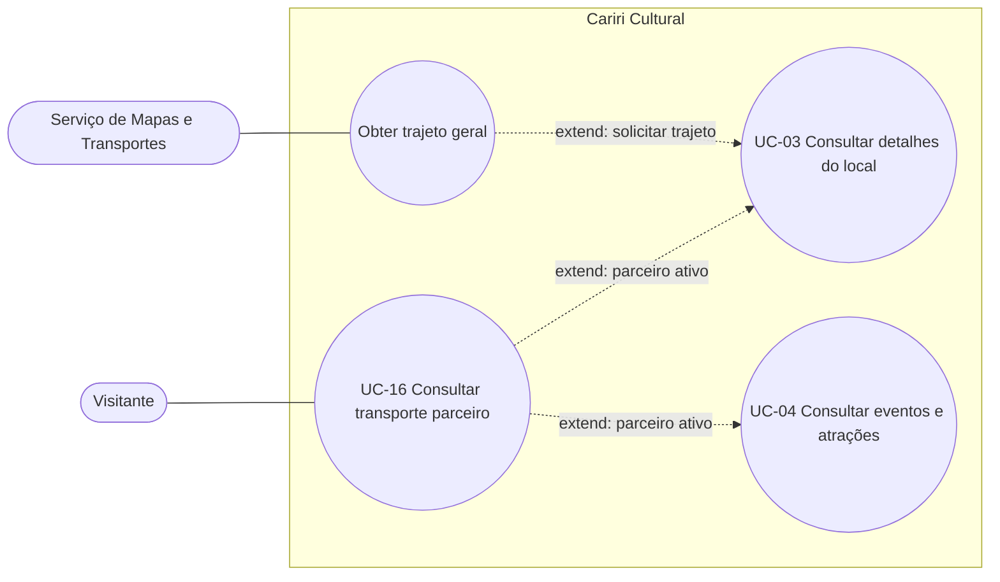
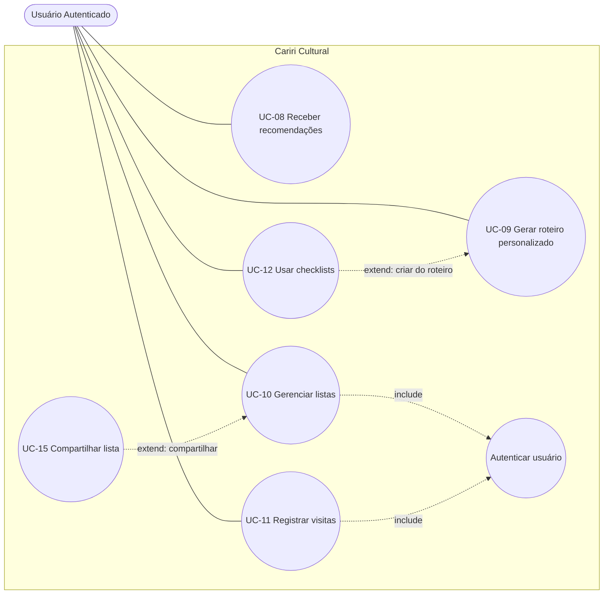
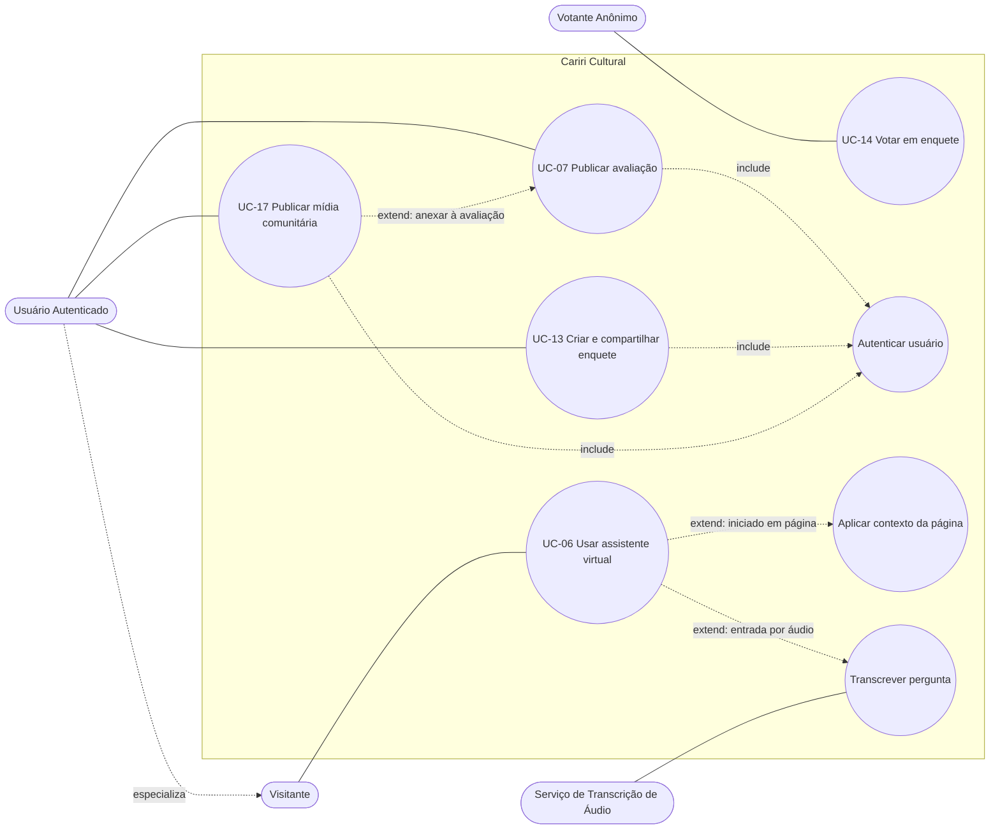

Os diagramas seguem a notação de **Diagrama de Casos de Uso (UML)** adaptada à sintaxe do Mermaid (que não possui um tipo de diagrama "use case" nativo):

- **Atores** → forma "stadium" (`([Texto])`), a aproximação mais próxima do boneco-palito em Mermaid.
- **Casos de uso** → forma circular (`((Texto))`), aproximando a elipse UML.
- **Fronteira do sistema** → `subgraph`, representando o retângulo que envolve os casos de uso.
- **Relações `include` e `extend`** → setas tracejadas rotuladas.
- **Associação ator–caso de uso** → linha simples (`---`).
- **Generalização/especialização de ator** → seta tracejada rotulada "especializa".

---

## 1. Visão geral da linha de base

Resumo macro dos épicos Must/Should/Could e seus atores principais. Serve como mapa de navegação para os diagramas detalhados (2 a 5).

> Ver diagramas 2 a 5 para os casos de uso individuais (UC-01 a UC-17) que compõem cada bolha acima.

---

## 2. Experiência pública: Exploração e Detalhes

Ações do Visitante para encontrar e avaliar informações básicas de locais e eventos.

---

## 3. Experiência pública: Logística e Deslocamento

Isolado para não poluir o diagrama de exploração. Mostra como o usuário lida com trajetos e transporte parceiro.

---

## 4. Área pessoal: Planejamento e Roteiros

Funcionalidades exclusivas do Usuário Autenticado para organizar sua própria experiência.

---

## 5. Engajamento: Comunidade, Votação e Assistente

Interação social, publicação de conteúdo e uso do assistente virtual.

---

## 6. Épico 8 fora da linha de base

UC-18 a UC-25 não aparecem nos diagramas acima porque ainda não foram validados.
