- Os diagramas seguem a notação de **Diagrama de Casos de Uso (UML)** utilizando **PlantUML**, que oferece suporte nativo a atores, casos de uso, fronteira do sistema e relações `<<include>>` e `<<extend>>`.
- **Atenção:** A autenticação de usuário comum é **pré-condição** de uso da plataforma, não um caso de uso (por isso não há nó de autenticação genérico nestes diagramas); o único caso de autenticação modelado é UC-038 (administrador), nos diagramas 8 e 9.
- **Atores e relações** reproduzem os campos "Ator principal", "Atores secundários", "Tipo de relação" e "Pontos de extensão" da especificação descritiva. Convenções adotadas:
  - `<<include>>`: seta tracejada do caso **base** para o caso **incluído**.
  - `<<extend>>`: seta tracejada do caso **extensor** para o caso **base**.
  - Atores secundários recebem associação, do mesmo modo que o ator principal.
  - **Usuário autenticado** é modelado como especialização de **Visitante** (generalização de ator), pois herda todos os casos de acesso público e acrescenta os que exigem sessão válida.
  - Casos exclusivamente incluídos e nunca iniciados diretamente pelo ator (UC-069, UC-071, UC-075) não recebem associação de ator: são alcançados a partir do caso base.

---

## 1. Visão geral por épico e ator

Código-fonte PlantUML

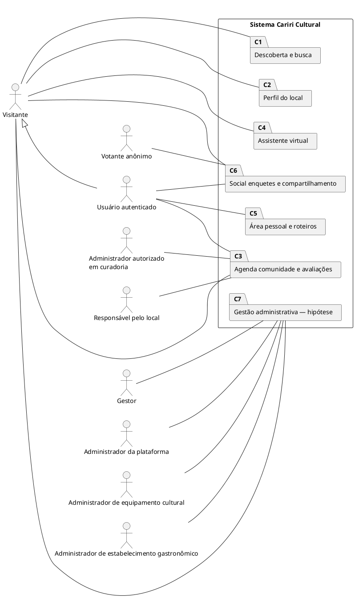

> Visão de contexto: os elementos internos são **pacotes** de casos de uso, não casos de uso individuais. O detalhamento está nos diagramas 2 a 11.

---

## 2. Descoberta e busca

Código-fonte PlantUML

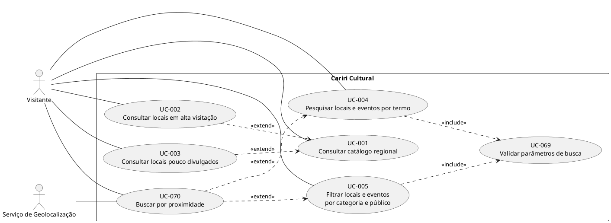

---

## 3. Perfil do local

Código-fonte PlantUML

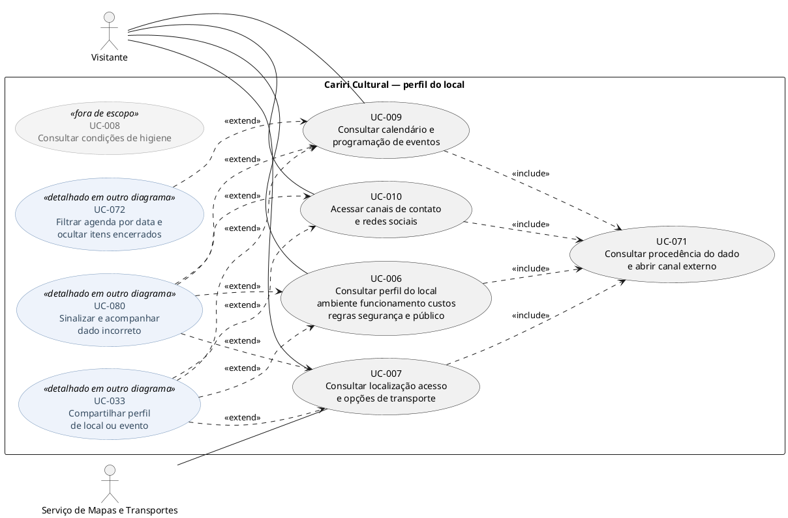

> Os antigos diagramas 3, 4 e 5 foram unificados aqui: a consolidação do Épico 2 reduziu o perfil do local a quatro casos principais (UC-006, UC-007, UC-009 e UC-010), e manter três recortes passou a repetir os mesmos nós.
> UC-008 aparece destacado por estar fora do escopo desta entrega; não recebe include nem extend enquanto essa decisão valer.
> UC-009 reaparece no diagrama 4, onde seu ciclo de vida é controlado por UC-072. UC-072, UC-080 e UC-033 são nós convidados, detalhados nos diagramas 4 e 7; permanecem dentro da fronteira do sistema porque são casos de uso do próprio Cariri Cultural, e aparecem aqui apenas como origem das relações `<<extend>>`. O ator principal de UC-080 e UC-033 é o usuário autenticado, associado a eles nos diagramas de origem.

---

## 4. Agenda, comunidade e avaliações

Código-fonte PlantUML

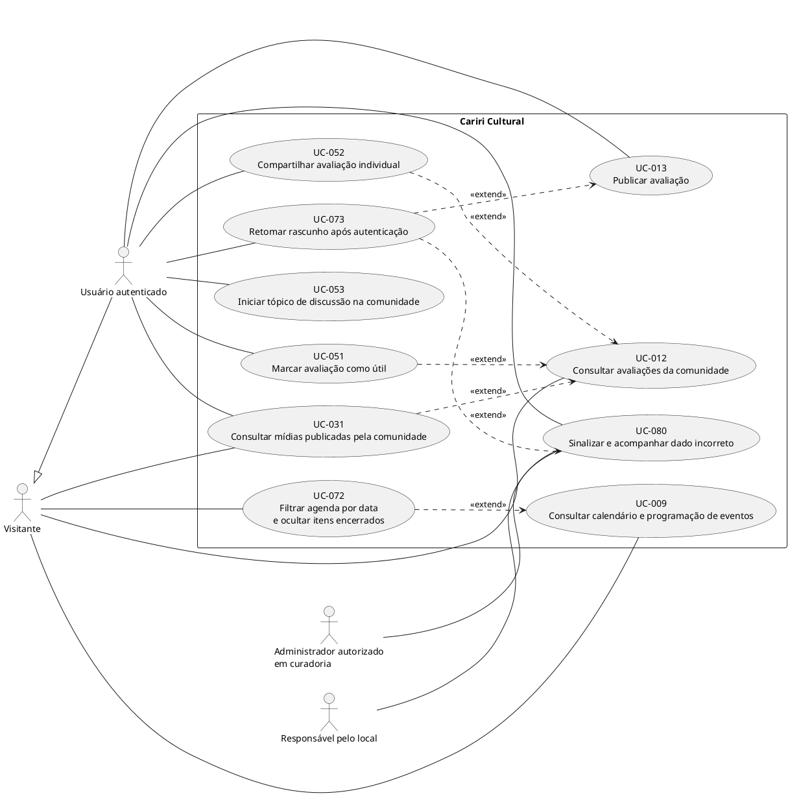

> Em UC-031 o visitante é o ator principal (consulta das mídias) e o usuário autenticado participa como ator secundário, ao publicar uma nova mídia.

---

## 5. Assistente virtual

Código-fonte PlantUML

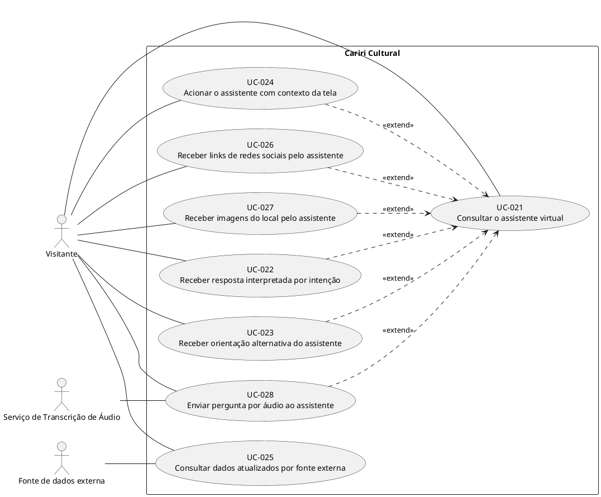

> UC-025 é o único caso deste recorte sem campo "Tipo de relação" na especificação descritiva; por isso aparece sem `<<extend>>` de UC-021, diferentemente dos demais casos do épico.

---

## 6. Área pessoal: recomendações, roteiros, listas e gamificação

Código-fonte PlantUML

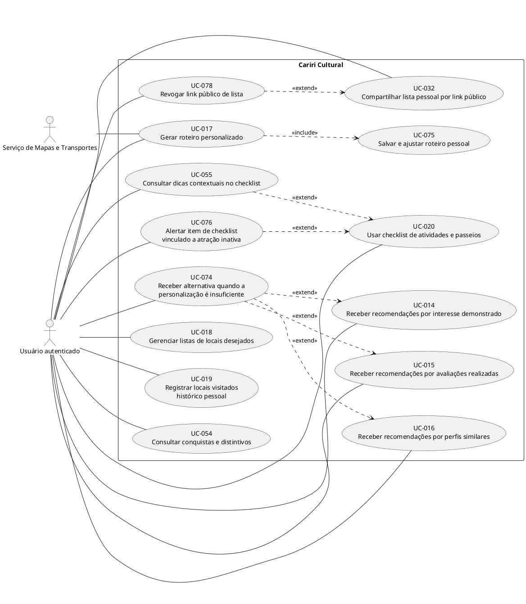

> Todos os casos do Épico 5 exigem sessão válida: o ator é o usuário autenticado, não o visitante. UC-075 não recebe associação de ator por ser alcançado exclusivamente pela inclusão a partir de UC-017.

---

## 7. Social, enquetes, transporte e compartilhamento

Código-fonte PlantUML

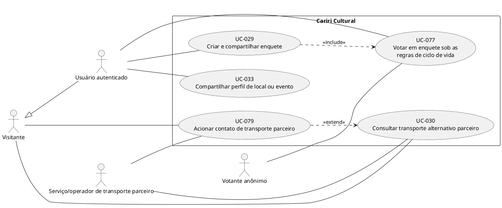

> Em UC-077 o votante anônimo é o ator principal; o criador da enquete (usuário autenticado) participa como ator secundário, nas regras de alteração de opções e de encerramento.

---

## 8. Hipótese administrativa — equipamentos culturais e atrações
> [!WARNING]
> Os diagramas 8 a 11 modelam **hipóteses verificáveis**. O núcleo de cadastro administrativo (UC-034, UC-036, UC-038 a UC-040, UC-042 e UC-043) já integra a entrega atual; os demais casos do Épico 8 (UC-041 e UC-044 a UC-050) e a totalidade dos Épicos 11 a 13 permanecem fora dela. Em todos os casos, os fluxos e telas administrativas ainda dependem de validação com os futuros stakeholders administrativos.

Código-fonte PlantUML

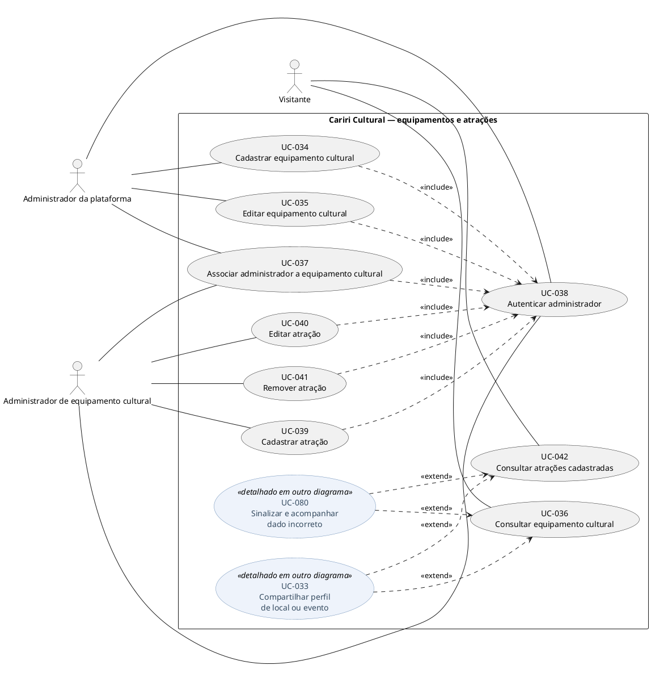

> UC-036 e UC-042 são consultas públicas: não incluem UC-038, pois o acesso à informação não exige autenticação (RN-022).
> Em UC-037, o administrador de equipamento cultural é ator secundário. Em UC-038, o administrador da plataforma é ator secundário — o fluxo de autenticação é o mesmo para qualquer perfil administrativo.

---

## 9. Hipótese administrativa — estabelecimentos, ofertas e publicações

Código-fonte PlantUML

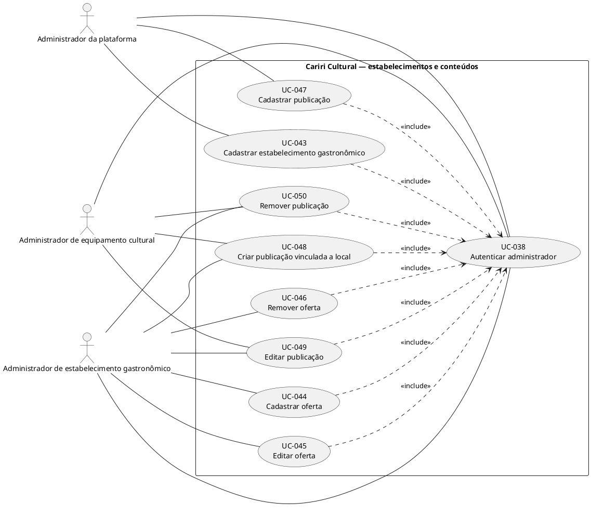

> UC-038 é o mesmo caso do diagrama 8; aparece nos dois recortes porque é incluído por ações de escrita de ambos. Seu ator principal é o administrador de equipamento cultural; o administrador da plataforma e o administrador de estabelecimento gastronômico participam como atores secundários do mesmo fluxo.

---

## 10. Gestão de estabelecimentos — painel e indicadores

Código-fonte PlantUML

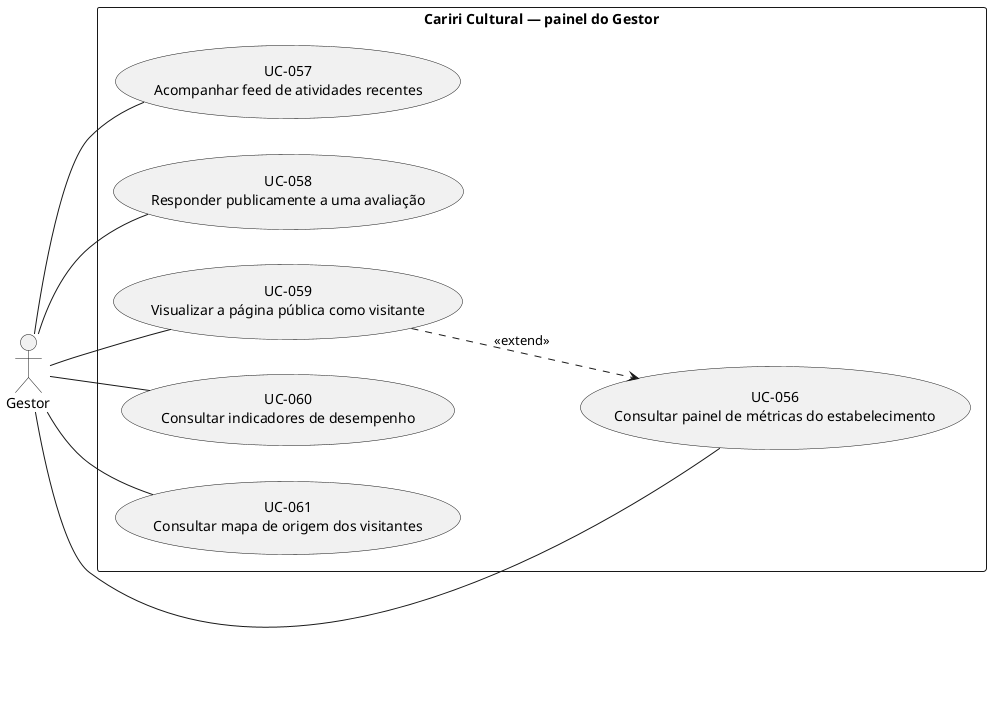

---

## 11. Perfil, sessão e navegação global

Código-fonte PlantUML

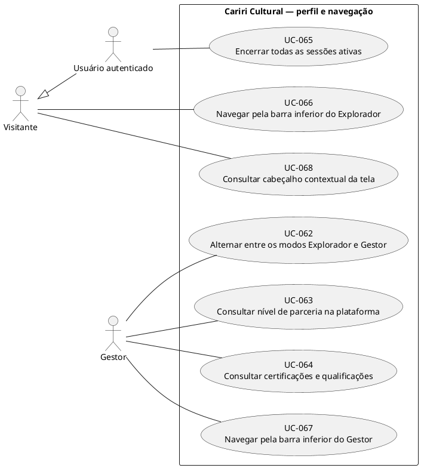

---
